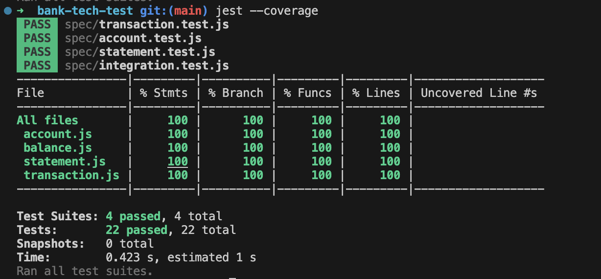
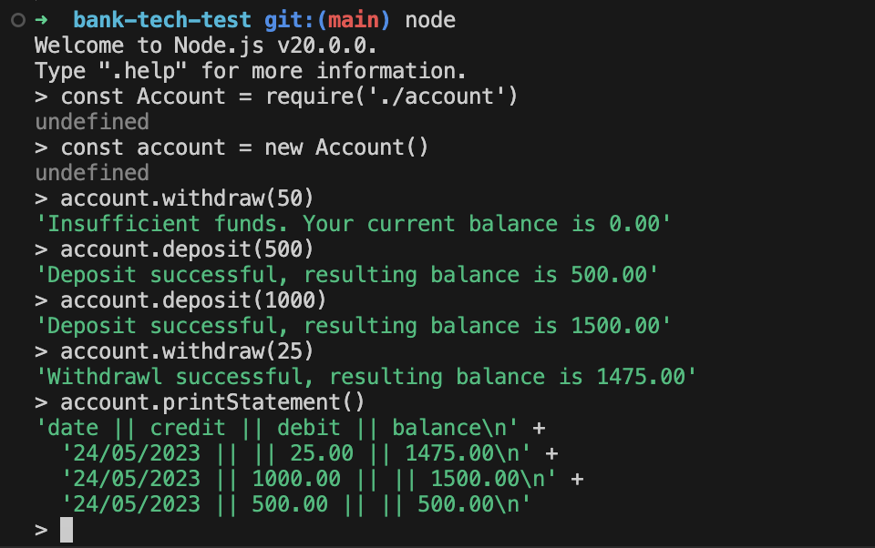

# Bank Tech Test

This repository contains a solution for Makers Academy Bank Tech Test - a mock take-home tech test. Thcommand-line application that simulates basic banking operations. It allows users to create accounts, deposit funds, withdraw funds, and view their account statements.

## Getting started

Clone the repo:

 `git clone https://github.com/tomcarmichael/bank-tech-test.git`

Install dependancies:

`npm install` 

Run tests to ensure the project is set up correctly:

`jest`

## Usage

This is program is designed to be used with Node running at the command line =>

`node` 

`const Account = require('./account')`

`const account = new Account()`

You now have access to `deposit(amount)`, `withdraw(amount)`, and `printStatement()` as methods of `account`

Note that amounts should be integers and this program is not currency specific

## Running tests

`jest` 

## Runtime screenshots

## Design and Implementation

The design of the program attempted to adhere to the principles of OOD as best as possible, but this is an area I am still learning in. 

In the `planning` sub-directory, the `recipe.md` file includes the requirements provided to me for the program. I used elements of a requirements management style 'use case' to help my initial planning, and this informed by choice of classes and their relationships, outline in the `classDiagram.uxf` and furhter in the `excalidrawSequenceDiagram.png`. During development some details of the implementation diverged from these plans, notably deciding to use only one Transaction class with a `type` property, rather than two very similar `Withdrawl` and `Deposit` classes

## Reflections and areas for future improvement

- Based on the supplied Acceptance Criteria, the program only works correctly when supplied with integer inputs to `withdraw()` and `deposit()`. In a real-world implementation, to avoid any problems with floating point imprecision, amounts would be stored in pence/cents, to avoid any issues with floating point imprecision, and the UI would accept 2 decimal place floating point numbers

- The brief requires that the resulting balance of each historical transaction be printed in the statement. I saw that this could be recorded with that transaction (more use of memory) or it could be calculated starting from the current balance at the time of statement creation and based on the amount and type of each transaction (more use of computation). I chose the former with the thought to optimise performance for user experience given a large data set.
  
- Returning a message that the deposit / withdrawl was succesful and the resulting balance was not specified in the brief, but useful as a means of testing functionality, and for the user. If building this program in a real world situation I would clarify whether the product owner wanted this.

